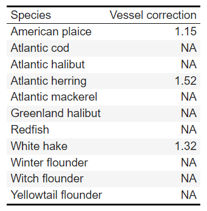
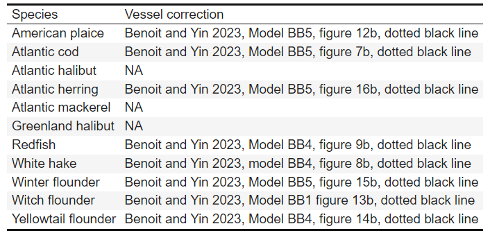
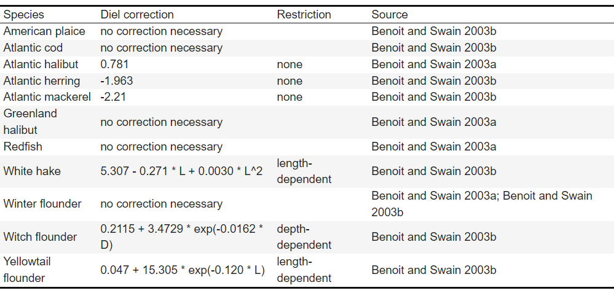

<!-- README.md is generated from README.Rmd. Please edit that file -->

```{r, include = FALSE}
knitr::opts_chunk$set(
  collapse = TRUE,
  comment = "#>",
  fig.path = "man/figures/README-",
  out.width = "100%"
)
```

# get.gulf 


<!-- badges: start -->
<!-- badges: end -->

R functions to retrieve DFO data housed internally and often associated with package `gulf` (*e.g.,* [here](https://github.com/dfo-gulf-science/gulf/tree/master), [here](https://github.com/ricardd/gulf2), and [here](https://github.com/TobieSurette/gulf.data)), and perform downstream processing and quality control prior to analysis.

# Availability

  * A fully functional **get.gulf** is available to DFO Gulf Fisheries staff who have the in-house `gulf` package as well as access to `\\ENT.dfo-mpo.ca\dfo-mpo\GROUP\GLF\Regional_Shares\AquaRes_Common\FishFramSci`.

# Installation

Contact jolene.sutton@dfo-mpo.gc.ca
  
# Southern Gulf of St. Lawrence September Research Vessel (sGSL RV)

## Survey overview
  + **Years:** 1971 - 2024
  
  + **Vessels:**
    + E.E. Prince (1971 - 1985) fishing a Yankee-36 trawl
    + Lady Hammond (1985 - 1991) fishing a Western IIA bottom-trawl
    + CCGS Alfred Needler (1992 - 2002, and 2004 - 2005) fishing a Western IIA bottom-trawl
    + CCGS Wilfred Templeman (2003) fishing a Western IIA bottom-trawl
    + CCGS Teleost (2004 - 2022) fishing a Western IIA bottom-trawl
    + CCGS Capt. Jacques Cartier (2021 - 2024), fishing a modified version of the Northeast Fisheries Science Center Ecosystem Survey Trawl, NEST (trawl details in [Denton 2020](https://waves-vagues.dfo-mpo.gc.ca/library-bibliotheque/4087638x.pdf); modifications outlined in [Ricard et al. 2023](https://publications.gc.ca/collections/collection_2023/mpo-dfo/Fs97-6-3547-eng.pdf)).

## Vessel correction factors
  + **get.gulf** currently applies vessel correction factors for years 1993 onward
  + When catches are adjusted for vessel effects, non-Teleost catches are adjusted to Teleost equivalents
  + To adjust catches from the CCGS Alfred Needler and the CCGS Wilfred Templeman, **get.gulf** applies vessel correction factors described in [Benoît 2006](https://www.dfo-mpo.gc.ca/csas-sccs/publications/resdocs-docrech/2006/2006_008-eng.htm).
  + To adjust catches from the CCGS Capt. Jacques Cartier, **get.gulf** applies vessel correction factors described in [Benoît and Yin, 2023](https://waves-vagues.dfo-mpo.gc.ca/library-bibliotheque/41220614.pdf).
  + See `?get_catch`

### Correction factors to adjust catches by the CCGS Alfred Needler and the CCGS Wilfred Templeman to be equivalent to the CCGS Teleost.




### Correction factors to adjust catches by the CCGS Capt. Jacques Cartier to be equivalent to the CCGS Teleost.




## Diel correction factors
  + **get.gulf** applies diel correction factors to night catches made from the CCGS Teleost, or to night catches that have been adjusted to be equivalent to the CCGS Teleost.
  + Correction factors used by **get.gulf** are described in [Benoît and Swain, 2003a](https://academic.oup.com/icesjms/article/60/6/1298/653532?login=true), [Benoît and Swain, 2003b](https://publications.gc.ca/collections/collection_2012/mpo-dfo/Fs97-6-2505-eng.pdf), and  [Benoît 2006](https://waves-vagues.dfo-mpo.gc.ca/library-bibliotheque/331162.pdf).
  + Diel correction factors are only implemented for specific species, and only for years 1993 and onward. 
  + See `?get_catch`.

### Correction factors to adjust night catches to be equivalent to day.



# Commercial Landings
Commercial landings data go back to 1985. **get.gulf** retrieves data housed at DFO Quebec Region. See `?get_ziff`.
